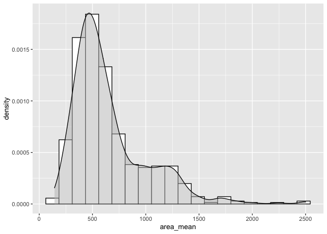

Mini Data-Analysis Deliverable 1
================
Yi Tong (Maggie) Liu

# Introduction

This is **Maggie’s submission for Milestone 1 of the Mini Data Analysis
Project**. This notebook is based on the datasets provided by the
`datateachr` package by Hayley Boyce and Jordan Bourak.

The `datateachr` package provides 7 semi-tidy datasets:

  - `apt_buildings`: Acquired courtesy of The City of Toronto’s Open
    Data Portal. It currently has 3455 rows and 37 columns.
  - `building_permits`: Acquired courtesy of The City of Vancouver’s
    Open Data Portal. It currently has 20680 rows and 14 columns.
  - `cancer_sample`: Acquired courtesy of UCI Machine Learning
    Repository. It currently has 569 rows and 32 columns.
  - `flow_sample`: Acquired courtesy of The Government of Canada’s
    Historical Hydrometric Database. It currently has 218 rows and 7
    columns.
  - `parking_meters`: Acquired courtesy of The City of Vancouver’s Open
    Data Portal. It currently has 10032 rows and 22 columns.
  - `steam_games`: Acquired courtesy of Kaggle. It currently has 40833
    rows and 21 columns.
  - `vancouver_trees`: Acquired courtesy of The City of Vancouver’s Open
    Data Portal. It currently has 146611 rows and 20 columns.

Running this notebook’s source code requires the installation of the
`datateachr` package:

    install.packages("devtools")
    devtools::install_github("UBC-MDS/datateachr")

Also install the `ggcorrplot` package to visualize correlation matrices.

    install.packages("ggcorrplot")

We begin by loading the necessary packages.

``` r
library(datateachr) # provides the datasets
library(tidyverse) # provides data analysis libraries, including ggplot2, dplyr, and tibble
library(ggcorrplot) # provides visualization for correlation matrices
```

# Task 1: Choose your favourite dataset (10 points)

In this section, I will use the short descriptions of the 7 datasets and
some simple exploration to determine which dataset I will use for my
mini data analysis project.

## 1.1 Choosing top 4 datasets

The 4 datasets that most appeal to me based on their short descriptions
are:

1.  `apt_buildings`: Acquired courtesy of The City of Toronto’s Open
    Data Portal. It currently has 3455 rows and 37 columns.
2.  `cancer_sample`: Acquired courtesy of UCI Machine Learning
    Repository. It currently has 569 rows and 32 columns.
3.  `flow_sample`: Acquired courtesy of The Government of Canada’s
    Historical Hydrometric Database. It currently has 218 rows and 7
    columns.
4.  `steam_games`: Acquired courtesy of Kaggle. It currently has 40833
    rows and 21 columns.

## 1.2 Exploring top 4 datasets

In this section, we will explore the above 4 datasets: `apt_buildings`,
`cancer_sample`, `flow_sample`, and `steam_games`. We will use `dplyr`
to find out at least 3 attributes about each dataset to get an idea of
what the data looks like.

### 1.2.1 Exploring `apt_buildings`

First, let’s `glimpse` the dataset to get an idea of what kind of
information it contains.

``` r
glimpse(apt_buildings)
```

    ## Rows: 3,455
    ## Columns: 37
    ## $ id                               <dbl> 10359, 10360, 10361, 10362, 10363, 10…
    ## $ air_conditioning                 <chr> "NONE", "NONE", "NONE", "NONE", "NONE…
    ## $ amenities                        <chr> "Outdoor rec facilities", "Outdoor po…
    ## $ balconies                        <chr> "YES", "YES", "YES", "YES", "NO", "NO…
    ## $ barrier_free_accessibilty_entr   <chr> "YES", "NO", "NO", "YES", "NO", "NO",…
    ## $ bike_parking                     <chr> "0 indoor parking spots and 10 outdoo…
    ## $ exterior_fire_escape             <chr> "NO", "NO", "NO", "YES", "NO", NA, "N…
    ## $ fire_alarm                       <chr> "YES", "YES", "YES", "YES", "YES", "Y…
    ## $ garbage_chutes                   <chr> "YES", "YES", "NO", "NO", "NO", "NO",…
    ## $ heating_type                     <chr> "HOT WATER", "HOT WATER", "HOT WATER"…
    ## $ intercom                         <chr> "YES", "YES", "YES", "YES", "YES", "Y…
    ## $ laundry_room                     <chr> "YES", "YES", "YES", "YES", "YES", "Y…
    ## $ locker_or_storage_room           <chr> "NO", "YES", "YES", "YES", "NO", "YES…
    ## $ no_of_elevators                  <dbl> 3, 3, 0, 1, 0, 0, 0, 2, 4, 2, 0, 2, 2…
    ## $ parking_type                     <chr> "Underground Garage , Garage accessib…
    ## $ pets_allowed                     <chr> "YES", "YES", "YES", "YES", "YES", "Y…
    ## $ prop_management_company_name     <chr> NA, "SCHICKEDANZ BROS. PROPERTIES", N…
    ## $ property_type                    <chr> "PRIVATE", "PRIVATE", "PRIVATE", "PRI…
    ## $ rsn                              <dbl> 4154812, 4154815, 4155295, 4155309, 4…
    ## $ separate_gas_meters              <chr> "NO", "NO", "NO", "NO", "NO", "NO", "…
    ## $ separate_hydro_meters            <chr> "YES", "YES", "YES", "YES", "YES", "Y…
    ## $ separate_water_meters            <chr> "NO", "NO", "NO", "NO", "NO", "NO", "…
    ## $ site_address                     <chr> "65  FOREST MANOR RD", "70  CLIPPER R…
    ## $ sprinkler_system                 <chr> "YES", "YES", "NO", "YES", "NO", "NO"…
    ## $ visitor_parking                  <chr> "PAID", "FREE", "UNAVAILABLE", "UNAVA…
    ## $ ward                             <chr> "17", "17", "03", "03", "02", "02", "…
    ## $ window_type                      <chr> "DOUBLE PANE", "DOUBLE PANE", "DOUBLE…
    ## $ year_built                       <dbl> 1967, 1970, 1927, 1959, 1943, 1952, 1…
    ## $ year_registered                  <dbl> 2017, 2017, 2017, 2017, 2017, NA, 201…
    ## $ no_of_storeys                    <dbl> 17, 14, 4, 5, 4, 4, 4, 7, 32, 4, 4, 7…
    ## $ emergency_power                  <chr> "NO", "YES", "NO", "NO", "NO", "NO", …
    ## $ `non-smoking_building`           <chr> "YES", "NO", "YES", "YES", "YES", "NO…
    ## $ no_of_units                      <dbl> 218, 206, 34, 42, 25, 34, 14, 105, 57…
    ## $ no_of_accessible_parking_spaces  <dbl> 8, 10, 20, 42, 12, 0, 5, 1, 1, 6, 12,…
    ## $ facilities_available             <chr> "Recycling bins", "Green Bin / Organi…
    ## $ cooling_room                     <chr> "NO", "NO", "NO", "NO", "NO", "NO", "…
    ## $ no_barrier_free_accessible_units <dbl> 2, 0, 0, 42, 0, NA, 14, 0, 0, 1, 25, …

`apt_buildings` has the following 3 attributes:

1.  It 37 columns, and 3,455 rows/observations.
2.  It has both quantitative (columns with type `dbl`) and qualitative
    values (columns with type `chr`).
3.  While most of the columns of type `chr` appear to be categorical
    (e.g., we see repeated values of “DOUBLE PANE” for the column
    `window_type`), it has some columns that appear to be free text and
    not collected as categorical data. For instance, the `bike_parking`
    column shows an entry with a sentence description of the bike
    parking, rather than strict categories.

Let’s take a look at the unique entries in the `bike_parking` column.

``` r
apt_buildings %>%
  select("bike_parking") %>%
  distinct() 
```

    ## # A tibble: 195 × 1
    ##    bike_parking                                        
    ##    <chr>                                               
    ##  1 0 indoor parking spots and 10 outdoor parking spots 
    ##  2 0 indoor parking spots and 34 outdoor parking spots 
    ##  3 Not Available                                       
    ##  4 12 indoor parking spots and 0 outdoor parking spots 
    ##  5 0 indoor parking spots and 15 outdoor parking spots 
    ##  6 0 indoor parking spots and 0 outdoor parking spots  
    ##  7 0 indoor parking spots and 7 outdoor parking spots  
    ##  8 8 indoor parking spots and 0 outdoor parking spots  
    ##  9 12 indoor parking spots and 90 outdoor parking spots
    ## 10 0 indoor parking spots and 18 outdoor parking spots 
    ## # … with 185 more rows

We will have to do some string parsing to determine the number of indoor
and outdoor parking spots from the `bike_storage` column\!

### 1.2.2 Exploring `cancer_sample`

First, let’s `glimpse` the dataset to get an idea of what kind of
information it contains.

``` r
glimpse(cancer_sample)
```

    ## Rows: 569
    ## Columns: 32
    ## $ ID                      <dbl> 842302, 842517, 84300903, 84348301, 84358402, …
    ## $ diagnosis               <chr> "M", "M", "M", "M", "M", "M", "M", "M", "M", "…
    ## $ radius_mean             <dbl> 17.990, 20.570, 19.690, 11.420, 20.290, 12.450…
    ## $ texture_mean            <dbl> 10.38, 17.77, 21.25, 20.38, 14.34, 15.70, 19.9…
    ## $ perimeter_mean          <dbl> 122.80, 132.90, 130.00, 77.58, 135.10, 82.57, …
    ## $ area_mean               <dbl> 1001.0, 1326.0, 1203.0, 386.1, 1297.0, 477.1, …
    ## $ smoothness_mean         <dbl> 0.11840, 0.08474, 0.10960, 0.14250, 0.10030, 0…
    ## $ compactness_mean        <dbl> 0.27760, 0.07864, 0.15990, 0.28390, 0.13280, 0…
    ## $ concavity_mean          <dbl> 0.30010, 0.08690, 0.19740, 0.24140, 0.19800, 0…
    ## $ concave_points_mean     <dbl> 0.14710, 0.07017, 0.12790, 0.10520, 0.10430, 0…
    ## $ symmetry_mean           <dbl> 0.2419, 0.1812, 0.2069, 0.2597, 0.1809, 0.2087…
    ## $ fractal_dimension_mean  <dbl> 0.07871, 0.05667, 0.05999, 0.09744, 0.05883, 0…
    ## $ radius_se               <dbl> 1.0950, 0.5435, 0.7456, 0.4956, 0.7572, 0.3345…
    ## $ texture_se              <dbl> 0.9053, 0.7339, 0.7869, 1.1560, 0.7813, 0.8902…
    ## $ perimeter_se            <dbl> 8.589, 3.398, 4.585, 3.445, 5.438, 2.217, 3.18…
    ## $ area_se                 <dbl> 153.40, 74.08, 94.03, 27.23, 94.44, 27.19, 53.…
    ## $ smoothness_se           <dbl> 0.006399, 0.005225, 0.006150, 0.009110, 0.0114…
    ## $ compactness_se          <dbl> 0.049040, 0.013080, 0.040060, 0.074580, 0.0246…
    ## $ concavity_se            <dbl> 0.05373, 0.01860, 0.03832, 0.05661, 0.05688, 0…
    ## $ concave_points_se       <dbl> 0.015870, 0.013400, 0.020580, 0.018670, 0.0188…
    ## $ symmetry_se             <dbl> 0.03003, 0.01389, 0.02250, 0.05963, 0.01756, 0…
    ## $ fractal_dimension_se    <dbl> 0.006193, 0.003532, 0.004571, 0.009208, 0.0051…
    ## $ radius_worst            <dbl> 25.38, 24.99, 23.57, 14.91, 22.54, 15.47, 22.8…
    ## $ texture_worst           <dbl> 17.33, 23.41, 25.53, 26.50, 16.67, 23.75, 27.6…
    ## $ perimeter_worst         <dbl> 184.60, 158.80, 152.50, 98.87, 152.20, 103.40,…
    ## $ area_worst              <dbl> 2019.0, 1956.0, 1709.0, 567.7, 1575.0, 741.6, …
    ## $ smoothness_worst        <dbl> 0.1622, 0.1238, 0.1444, 0.2098, 0.1374, 0.1791…
    ## $ compactness_worst       <dbl> 0.6656, 0.1866, 0.4245, 0.8663, 0.2050, 0.5249…
    ## $ concavity_worst         <dbl> 0.71190, 0.24160, 0.45040, 0.68690, 0.40000, 0…
    ## $ concave_points_worst    <dbl> 0.26540, 0.18600, 0.24300, 0.25750, 0.16250, 0…
    ## $ symmetry_worst          <dbl> 0.4601, 0.2750, 0.3613, 0.6638, 0.2364, 0.3985…
    ## $ fractal_dimension_worst <dbl> 0.11890, 0.08902, 0.08758, 0.17300, 0.07678, 0…

`cancer_sample` has the following 3 attributes:

1.  It has 32 columns and 569 rows.
2.  It only has one qualitative column (`diagnosis`, with type `chr`),
    while the rest of them are quantitative with type `dbl`.
3.  Each of the quantitative columns also has a corresponding standard
    error. For instance, `symmetry_worst` has a correpsonding
    `symmetry_se` value. Since we’re only given the “worst”, or largest
    of each of the physical properties of cancerous cell nuclei images,
    we can use the corresponding se column to get an idea of the spread
    of the set of values it came from. However, we also note that the
    dataset doesn’t provide us with the number of observations for each
    of those properties (we don’t know how many nuclei were present in
    the image where those “worst” observations were taken).

### 1.2.3 Exploring `flow_sample`

First, let’s `glimpse` the dataset to get an idea of what kind of
information it contains.

``` r
glimpse(flow_sample)
```

    ## Rows: 218
    ## Columns: 7
    ## $ station_id   <chr> "05BB001", "05BB001", "05BB001", "05BB001", "05BB001", "0…
    ## $ year         <dbl> 1909, 1910, 1911, 1912, 1913, 1914, 1915, 1916, 1917, 191…
    ## $ extreme_type <chr> "maximum", "maximum", "maximum", "maximum", "maximum", "m…
    ## $ month        <dbl> 7, 6, 6, 8, 6, 6, 6, 6, 6, 6, 6, 7, 6, 6, 6, 7, 5, 7, 6, …
    ## $ day          <dbl> 7, 12, 14, 25, 11, 18, 27, 20, 17, 15, 22, 3, 9, 5, 14, 5…
    ## $ flow         <dbl> 314, 230, 264, 174, 232, 214, 236, 309, 174, 345, 185, 24…
    ## $ sym          <chr> NA, NA, NA, NA, NA, NA, NA, NA, NA, NA, NA, NA, NA, NA, N…

`flow_sample` has the following 3 attributes:

1.  It has 7 columns and 218 rows.
2.  While has both qualitative columns (type `chr`), and quantitative
    columns (type `dbl`), some of the `dbl` columns could actually be
    categorical variables. For example, `year`, `month`, and `day` are
    all discrete values and not measured, whereas `flow` is measured and
    not categorical in nature.
3.  It appears to contain a column, `sym`, with many null values.

<!-- end list -->

``` r
sym_values <- select(flow_sample, "sym")
tribble(
  ~sym_is_na, ~sym_is_not_na,
  sum(is.na(sym_values)), sum(!is.na(sym_values))
)
```

    ## # A tibble: 1 × 2
    ##   sym_is_na sym_is_not_na
    ##       <int>         <int>
    ## 1       119            99

We see that the `sym` column is mostly null, with 119 NA values and 99
non-NA values.

### 1.2.4 Exploring `steam_games`

First, let’s `glimpse` the dataset to get an idea of what kind of
information it contains.

``` r
glimpse(steam_games)
```

    ## Rows: 40,833
    ## Columns: 21
    ## $ id                       <dbl> 1, 2, 3, 4, 5, 6, 7, 8, 9, 10, 11, 12, 13, 14…
    ## $ url                      <chr> "https://store.steampowered.com/app/379720/DO…
    ## $ types                    <chr> "app", "app", "app", "app", "app", "bundle", …
    ## $ name                     <chr> "DOOM", "PLAYERUNKNOWN'S BATTLEGROUNDS", "BAT…
    ## $ desc_snippet             <chr> "Now includes all three premium DLC packs (Un…
    ## $ recent_reviews           <chr> "Very Positive,(554),- 89% of the 554 user re…
    ## $ all_reviews              <chr> "Very Positive,(42,550),- 92% of the 42,550 u…
    ## $ release_date             <chr> "May 12, 2016", "Dec 21, 2017", "Apr 24, 2018…
    ## $ developer                <chr> "id Software", "PUBG Corporation", "Harebrain…
    ## $ publisher                <chr> "Bethesda Softworks,Bethesda Softworks", "PUB…
    ## $ popular_tags             <chr> "FPS,Gore,Action,Demons,Shooter,First-Person,…
    ## $ game_details             <chr> "Single-player,Multi-player,Co-op,Steam Achie…
    ## $ languages                <chr> "English,French,Italian,German,Spanish - Spai…
    ## $ achievements             <dbl> 54, 37, 128, NA, NA, NA, 51, 55, 34, 43, 72, …
    ## $ genre                    <chr> "Action", "Action,Adventure,Massively Multipl…
    ## $ game_description         <chr> "About This Game Developed by id software, th…
    ## $ mature_content           <chr> NA, "Mature Content Description  The develope…
    ## $ minimum_requirements     <chr> "Minimum:,OS:,Windows 7/8.1/10 (64-bit versio…
    ## $ recommended_requirements <chr> "Recommended:,OS:,Windows 7/8.1/10 (64-bit ve…
    ## $ original_price           <dbl> 19.99, 29.99, 39.99, 44.99, 0.00, NA, 59.99, …
    ## $ discount_price           <dbl> 14.99, NA, NA, NA, NA, 35.18, 70.42, 17.58, N…

`steam_games` has the following 3 attributes:

1.  It has 21 columns and 40,833 rows.
2.  It has both quantitative (e.g., `original_price`) and qualitative
    columns (e.g., `developer`).
3.  Right away, we notice that many of the columns of type `chr` are
    free-form text, such as `url` and `recent_reviews`. These values
    could be unique for each game `id`.

## 1.3 Narrowing down top 2 datasets

Based on the exploration in section 1.2, I found `cancer_sample` and
`steam_games` most interesting.

**`cancer_sample`**

I Found the `cancer_sample` dataset interesting because it lends itself
well to a prediction model. The outcome (`diagnosis`) is binary (either
“M” for malignant or “B” for benign) and well-defined. Being able to
predict the diagnosis from properties of cancerous cell images would
also extremely powerful and applicable in the healthcare setting. To
check whether this dataset would lend itself well to a prediction model,
we can also look at the distribution of outcomes.

``` r
cancer_sample %>%
  group_by(diagnosis) %>%
  count()
```

    ## # A tibble: 2 × 2
    ## # Groups:   diagnosis [2]
    ##   diagnosis     n
    ##   <chr>     <int>
    ## 1 B           357
    ## 2 M           212

While there are many more benign diagnoses than malignant ones, the
number of data points in each outcome is still high, and we could
reasonably construct training and testing datasets from this.

Finally, the dataset lends itself well to correlation analyses with the
large number of quantitative values. For example, we could look at the
correlation between `area_mean` and `symmetry_mean` among malignant and
benign tumours.

**`steam_games`**

I found the `steam_games` dataset interesting because it contains many
free-form text features. Parsing through language data could be
challenging, and I’m interested in seeing the relationships we can draw
from language alone. For example, we could investigate the relationship
between `recent_reviews` and `popular_tags` to find out whether certain
tags are correlated with higher reviews. We could also look at whether
we can predict whether a game is rated overall positive or overall
negative based on its features, such as tags, description, name, and
type.

Additionally, visualizing language data poses challenges, as we would
have to make decisions about representing language as categorical (for
example, whether or not a sentence contains a certain word) or
converting it to a quantitative value (for example, representing a
sentence as a bag-of-words vector).

## 1.4 Final dataset choice

My final dataset choice is `cancer_sample`. A research question I’m
interested in answering is: Can we predict cancer diagnosis from
quantitative features calculated from images of biopsies of breast
masses?

# Task 2: Exploring your dataset (15 points)

In this section, I will complete 4 of the following 8 exercises to dive
deeper into my dataset using `dplyr` and `ggplot`.

1.  Plot the distribution of a numeric variable.
2.  Create a new variable based on other variables in your data (only if
    it makes sense)
3.  Investigate how many missing values there are per variable. Can you
    find a way to plot this?
4.  Explore the relationship between 2 variables in a plot.
5.  Filter observations in your data according to your own criteria.
    Think of what you’d like to explore - again, if this was the
    `titanic` dataset, I may want to narrow my search down to passengers
    born in a particular year…
6.  Use a boxplot to look at the frequency of different observations
    within a single variable. You can do this for more than one variable
    if you wish\!
7.  Make a new tibble with a subset of your data, with variables and
    observations that you are interested in exploring.
8.  Use a density plot to explore any of your variables (that are
    suitable for this type of plot).

## 2.1 Exercises

The exercises I will complete are 1, 3, 4, and 8.

### 2.1.1 Chosen Exercise 1 (1): Numeric value distribution

*Exercise 1: Plot the distribution of a numeric value.*

``` r
# Plotting a histogram of the area_mean column
cancer_sample %>%
  ggplot(aes(x=area_mean)) + 
  geom_histogram(aes(y=..density..), bins=20, colour="black", fill="white") +
  geom_density(fill="grey", alpha=0.5) +
  scale_color_grey() +
  scale_fill_grey()
```

<!-- -->

We see that mean area of nuclei in a single image is right-skewed, with
the highest number of observations around 500 units squared.

Let us also plot the density curve coloured by diagnosis.

``` r
# Plotting a density curve of the area_mean column, shaded by diagnosis
cancer_sample %>%
  ggplot(aes(x=area_mean, colour=diagnosis, fill=diagnosis)) + 
  geom_density(alpha=0.5) +
  scale_color_grey() +
  scale_fill_grey() 
```

<!-- -->

While benign (B) breast masses tend to have a smaller area, with lower
variance, malignant (M) breast masses have a larger area with greater
variance.

### 2.1.2 Chosen Exercise 2 (3): Missing values

*Exercise 3: Investigate how many missing values there are per variable.
Can you find a way to plot this?*

``` r
# Count the total number of NA values in the cancer_sample dataset
cancer_sample %>%
  rowwise %>%
  summarise(NA_count = sum(is.na(.))) %>%
  sum()
```

    ## [1] 0

We see that there are no missing values\!

### 2.1.3 Chosen Exercise 3 (4): Relationship between two variables

*Exercise 4: Explore the relationship between 2 variables in a plot.*

Let’s look at the relationship between `compactness_mean` and
`area_mean`.

``` r
# Scatter plot between compactness_mean and area_mean
cancer_sample %>%
  ggplot(aes(x = area_mean, y = compactness_mean)) + 
  geom_point(alpha = 0.5)
```

<!-- -->

The above scatter plot shows us that there is a positive correlation
between `area_mean` and `compactness_mean`, with a high density of
points between 0 and 0.1 compactness, and 0 and 1000 area.

Let us also plot this relationship for each
diagnosis.

``` r
# Scatter plot between compactness_mean and area_mean, faceted by diagnosis
cancer_sample %>%
  ggplot(aes(x = area_mean, y = compactness_mean)) + 
  facet_grid(cols=vars(diagnosis)) +
  geom_point(alpha = 0.5)
```

<!-- -->

Once again, we see that there is greater variation of area and
compactness combinations among malignant (M) diagnoses, while benign (B)
images have a smaller variance. In the benign figure, the area is
centered around 500, and the compactness around 0.07, with a few clear
outliers. On the other hand, in the malignant figure, the data points
are much more spread out but still show an overall slight positive
correlation between area and compactness.

We can use a correlation matrix to visualize the relationship between
each pair of variables. For this visualization, let us only consider the
mean values.

``` r
mean_values <- select(cancer_sample, ends_with("_mean"))
corr_values <- round(cor(mean_values), 1)
ggcorrplot(corr_values, colors=c("white", "grey", "black"))
```

<!-- -->
\#\#\# 2.1.4 Chosen Exercise 4 (8): Density plot of one variable

*Exercise 8: Use a density plot to explore any of your variables (that
are suitable for this type of plot).*

We’ve already looked at how the `area_mean` column is distributed. Let
us now look at the `area_worst` column.

``` r
# Plotting a histogram and density of the area_worst column
cancer_sample %>%
  ggplot(aes(x=area_worst)) + 
  geom_histogram(aes(y=..density..), bins=20, colour="black", fill="white") +
  geom_density(fill="grey", alpha=0.5) +
  scale_color_grey() +
  scale_fill_grey()
```

<!-- -->

As we saw in the previous figures related to area, we see the highest
density of observations with area around 500.

Let us also look at how `area_worst` differs by diagnosis.

``` r
# Plotting a density curve of the area_worst column, shaded by diagnosis
cancer_sample %>%
  ggplot(aes(x=area_worst, colour=diagnosis, fill=diagnosis)) + 
  geom_density(alpha=0.5) +
  scale_color_grey() +
  scale_fill_grey() 
```

<!-- -->

As expected, we see similar results to the `area_mean` column, with
benign (B) images having `area_worst` less spread out and more tightly
centered than malignant (M) images.

## 2.2 Explanation for chosen exercises

**Exercise 1:** All variables other than `diagnosis` were quantitative,
so it makes sense to look at the distributions of any of the variables.
Since the outcome (`diagnosis`) is binary, it also makes sense to
compare the distributions of each quantitative variable across the two
outcomes.

**Exercise 3:** The `cancer_sample` dataset contains observed
measurements from images of nuclei. I thought it was important to check
for missing values, since it’s possible that some measurements were not
recorded or could not be obtained from a single image. Thankfully, there
are no missing values in our dataset.

**Exercise 4:** As all the measurements within an observation come from
the same image, it makes sense to look at the relationships between
those measurements. For instance, looking at the relationship between
`area_mean` and `compactness_mean` across each outcome can give us an
idea of what benign tissue masses might look like, compared to
malignant. Constructing a correlation matrix to show the relationship
between each pair of variables would also be helpful in understanding
how the measurements relate to one another.

**Exercise 8:** All variables other than `diagnosis` are continuous in
nature, so creating a density plot for any of them makes sense to
visualize the distribution.

# Task 3: Write your research questions (5 points)

1.  What are the relationships between each individual nucleus
    measurement and the diagnosis outcome? For example, is a larger
    nucleus radius positively correlated with malignant diagnosis?
2.  What are the relationships between each pair of nucleus measurements
    among malignant and benign diagnoses? For example, among malignant
    diagnoses, what is the relationship between surface area and radius?
    What about among benign diagnoses?
3.  What impact does the standard error for each measurement have on its
    relationship with the diagnosis?
4.  Can we accurately predict whether a diagnosis will be benign or
    malignant using the provided measurements from images of nuclei?
