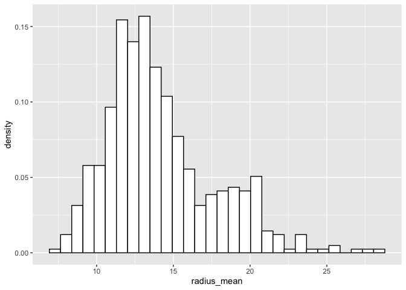
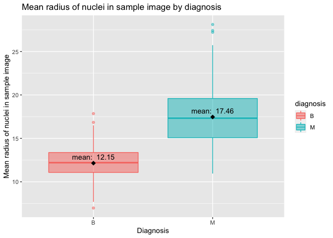
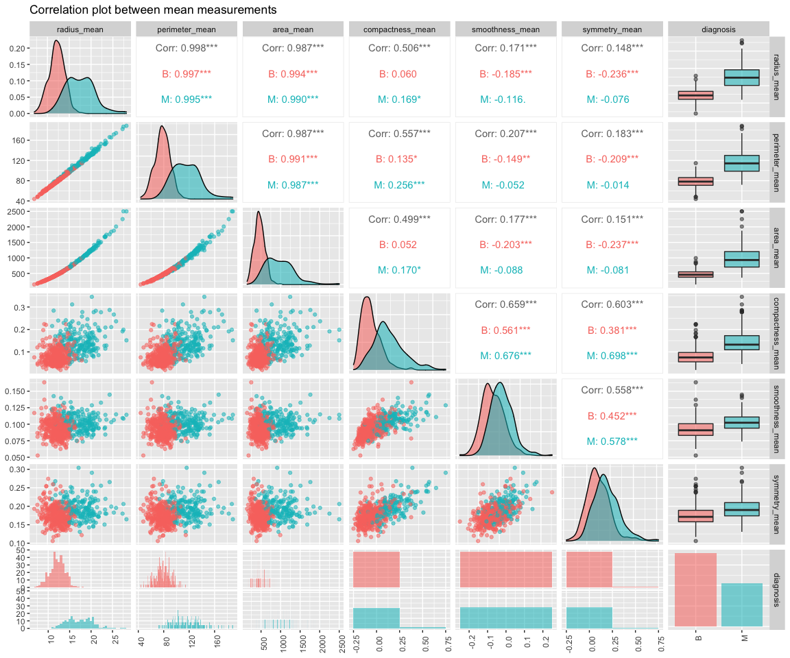
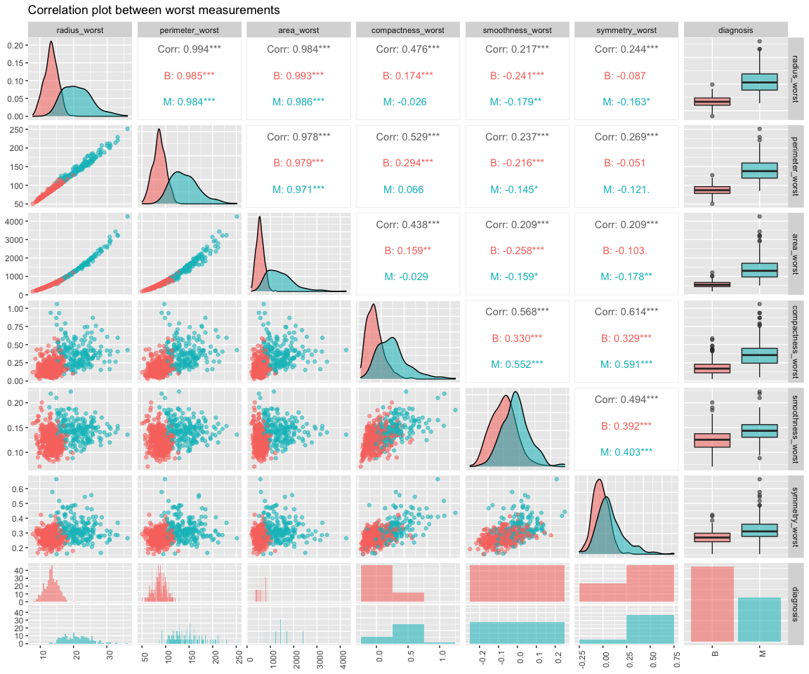
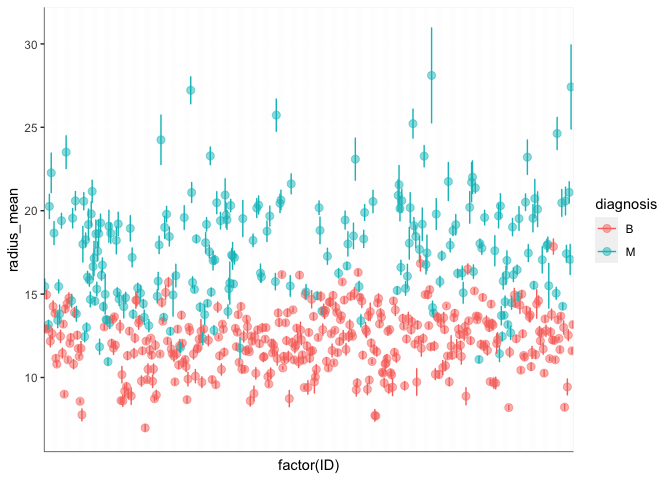
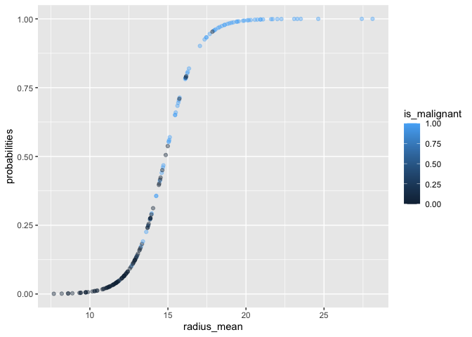

Mini Data-Analysis Deliverable 2
================
Yi Tong (Maggie) Liu

# Introduction

This is **Maggie’s submission for Milestone 2 of the Mini Data Analysis
Project**.

**Recap:** In Milestone 1, I chose a dataset from the `datateachr`
package by Hayley Boyce and Jordan Bourak. The dataset I chose wwas
`cancer_sample`. The analyses in this notebook will be based on the
`cancer_sample` dataset, and will aim to work towards answering my
research question: *Can we predict cancer diagnosis from quantitative
features calculated from images of biopsies of breast masses?*

Running the source code in this notebook requires installation of the
following packages: `devtools`, `datateachr`, `tidyverse`, `caret`, and
`GGally`.

We begin by loading the necessary pacakages.

``` r
library(datateachr) # provides the cancer_sample dataset
library(tidyverse) # provides data analysis libraries, including ggplot2, dplyr, and tibble
library(GGally) # extends ggplot2 for correlation plots
library(caret) # provides model evaluation tools
```

# Task 1: Process and summarize your data (15 points)

## 1.1 Research questions from Milestone 1 (2.5 points)

The 4 research questions I defined in Milestone 1 were:

1.  What are the relationships between each individual nucleus
    measurement and the diagnosis outcome? For example, is a larger
    nucleus radius positively correlated with malignant diagnosis?
2.  What are the relationships between each pair of nucleus measurements
    among malignant and benign diagnoses? For example, among malignant
    diagnoses, what is the relationship between surface area and radius?
    What about among benign diagnoses?
3.  What impact does the standard error for each measurement have on its
    relationship with the diagnosis?
4.  Can we accurately predict whether a diagnosis will be benign or
    malignant using the provided measurements from images of nuclei?

## 1.2 Summarizing and graphing tasks (10 points)

In this section, I’ll implement one summarizing task and one graphing
task for each of the research questions listed in section 1.1. The
options are listed below.

**Summarizing:**

1.  Compute the range, mean, and two other summary statistics of one
    numerical variable across the groups of one categorical variable
    from your data.
2.  Compute the number of observations for at least one of your
    categorical variables. Do not use the function table()\!
3.  Create a categorical variable with 3 or more groups from an existing
    numerical variable. You can use this new variable in the other
    tasks\! An example: age in years into “child, teen, adult, senior”.
4.  Based on two categorical variables, calculate two summary statistics
    of your choosing.

**Graphing:**

1.  Create a graph out of summarized variables that has at least two
    geom layers.
2.  Create a graph of your choosing, make one of the axes logarithmic,
    and format the axes labels so that they are “pretty” or easier to
    read.
3.  Make a graph where it makes sense to customize the alpha
    transparency.
4.  Create 3 histograms out of summarized variables, with each histogram
    having different sized bins. Pick the “best” one and explain why it
    is the best.

Before we start, let’s look at a sample of the data.

``` r
cancer_sample %>%
  select(ends_with("_mean"), diagnosis) %>%
  head(10)
```

    ## # A tibble: 10 × 11
    ##    radius_mean texture_mean perimeter_mean area_mean smoothness_mean
    ##          <dbl>        <dbl>          <dbl>     <dbl>           <dbl>
    ##  1        18.0         10.4          123.      1001           0.118 
    ##  2        20.6         17.8          133.      1326           0.0847
    ##  3        19.7         21.2          130       1203           0.110 
    ##  4        11.4         20.4           77.6      386.          0.142 
    ##  5        20.3         14.3          135.      1297           0.100 
    ##  6        12.4         15.7           82.6      477.          0.128 
    ##  7        18.2         20.0          120.      1040           0.0946
    ##  8        13.7         20.8           90.2      578.          0.119 
    ##  9        13           21.8           87.5      520.          0.127 
    ## 10        12.5         24.0           84.0      476.          0.119 
    ## # … with 6 more variables: compactness_mean <dbl>, concavity_mean <dbl>,
    ## #   concave_points_mean <dbl>, symmetry_mean <dbl>,
    ## #   fractal_dimension_mean <dbl>, diagnosis <chr>

### 1.2.1 Research question 1

**Question:** What are the relationships between each individual nucleus
measurement and the diagnosis outcome? For example, is a larger nucleus
radius positively correlated with malignant diagnosis?

**Summarizing:** (3) Create a categorical variable with 3 or more groups
from an existing numerical variable. You can use this new variable in
the other tasks\! An example: age in years into “child, teen, adult,
senior”.

We will group the `radius_mean` into small, mediu, and large. First
let’s take a look at how this column is distributed.

``` r
select(cancer_sample, radius_mean) %>%
  ggplot(aes(x=radius_mean, y=..density..)) +
  geom_histogram(color="black", fill="white", bins=30)
```

<!-- -->

``` r
radius_levels <- cancer_sample %>%
  select(diagnosis, radius_mean) %>%
  mutate(radius_mean_level = case_when(
    radius_mean < 12 ~ "small",
    radius_mean < 16 ~ "medium",
    TRUE ~ "large"
  ))

head(radius_levels, 10)
```

    ## # A tibble: 10 × 3
    ##    diagnosis radius_mean radius_mean_level
    ##    <chr>           <dbl> <chr>            
    ##  1 M                18.0 large            
    ##  2 M                20.6 large            
    ##  3 M                19.7 large            
    ##  4 M                11.4 small            
    ##  5 M                20.3 large            
    ##  6 M                12.4 medium           
    ##  7 M                18.2 large            
    ##  8 M                13.7 medium           
    ##  9 M                13   medium           
    ## 10 M                12.5 medium

**Graphing:** (1) Create a graph out of summarized variables that has at
least two geom layers.

Let us look at the radius\_mean column across diagnoses.

``` r
cancer_sample %>%
  select(diagnosis, radius_mean) %>%
  group_by(diagnosis) %>%
  ggplot(aes(diagnosis, radius_mean), .groups="keep") +
  geom_boxplot(aes(color=diagnosis, fill=diagnosis), alpha=0.5) +
  stat_summary(fun=mean, colour="black", geom="point", shape=18, size=3, show.legend=FALSE) + # Plot a black point for the mean
  stat_summary(fun=mean, aes(label=paste("mean: ", round(..y.., 2))), colour="black", geom="text",vjust=-0.7) + # Label the point with the mean value
  xlab("Diagnosis") + 
  ylab("Mean radius of nuclei in sample image") + 
  ggtitle("Mean radius of nuclei in sample image by diagnosis")
```

<!-- -->

### 1.2.2 Research question 2

**Question:** What are the relationships between each pair of nucleus
measurements among malignant and benign diagnoses? For example, among
malignant diagnoses, what is the relationship between surface area and
radius? What about among benign diagnoses?

**Summarizing:** (1) Compute the range, mean, and two other summary
statistics of one numerical variable across the groups of one
categorical variable from your data.

We will compute the range (split into min and max), mean, median,
variance, and interquartile range of the `radius_mean` column across
diagnosis.

``` r
cancer_sample %>%
  select(diagnosis, radius_mean) %>%
  group_by(diagnosis) %>%
  summarise(
    .groups="keep",
    range_min_radius_mean=min(radius_mean),
    range_max_radius_mean=max(radius_mean),
    mean_radius_mean=mean(radius_mean),
    median_radius_mean=median(radius_mean),
    variance_radius_mean=var(radius_mean),
    iqr_radius_mean=IQR(radius_mean)
  ) %>%
  column_to_rownames(var="diagnosis") %>%
  t(.)
```

    ##                               B        M
    ## range_min_radius_mean  6.981000 10.95000
    ## range_max_radius_mean 17.850000 28.11000
    ## mean_radius_mean      12.146524 17.46283
    ## median_radius_mean    12.200000 17.32500
    ## variance_radius_mean   3.170222 10.26543
    ## iqr_radius_mean        2.290000  4.51500

**Graphing:** (3) Make a graph where it makes sense to customize the
alpha transparency.

We’ll first look at the relationship between mean values, then look at
worst values. To simplify the visualization, we will only look at
following measurements: `radius`, `perimeter`, `area`, `compactness`,
`smoothness`, and `symmetry`.

``` r
cols <- c(
  "radius",
  "perimeter",
  "area",
  "compactness",
  "smoothness",
  "symmetry"
)
```

``` r
for (metric in list("mean", "worst")) {
  print(cancer_sample %>%
    select(paste(cols, metric, sep="_"), diagnosis) %>%
    ggpairs(
      mapping=aes(alpha=0.3, color=diagnosis),
      title=paste("Correlation plot between ", metric, " measurements", sep=""),
      lower=list(combo = wrap("facethist", binwidth=0.5)),
      progress=FALSE,
    ) + 
    theme(
      axis.text.x=element_text(angle=90), 
      axis.text.x.top=element_text(angle=45), 
      axis.text.y=element_text(angle=0), 
      axis.text.y.right=element_text(angle=45)
    ))
}
```

<!-- --><!-- -->

### 1.2.3 Research question 3

**Question:** What impact does the standard error for each measurement
have on its relationship with the diagnosis?

**Summarizing:** (1) Compute the range, mean, and two other summary
statistics of one numerical variable across the groups of one
categorical variable from your data.

We will compute the range (split into min and max), mean, median,
variance, and interquartile range of the `radius_se` column across
diagnosis.

``` r
cancer_sample %>%
  select(diagnosis, radius_se) %>%
  group_by(diagnosis) %>%
  summarise(
    .groups="keep",
    range_min_radius_se=min(radius_se),
    range_max_radius_se=max(radius_se),
    mean_radius_se=mean(radius_se),
    median_radius_se=median(radius_se),
    variance_radius_se=var(radius_se),
    iqr_radius_se=IQR(radius_se)
  ) %>%
  column_to_rownames(var="diagnosis") %>%
  t(.)
```

    ##                              B         M
    ## range_min_radius_se 0.11150000 0.1938000
    ## range_max_radius_se 0.88110000 2.8730000
    ## mean_radius_se      0.28408235 0.6090825
    ## median_radius_se    0.25750000 0.5472000
    ## variance_radius_se  0.01267192 0.1190516
    ## iqr_radius_se       0.13430000 0.3669250

**Graphing:** (3) Make a graph where it makes sense to customize the
alpha transparency.

Let’s see what the radius mean and radius se values for each observation
look like across diagnoses. Since there are many observations, we should
set the alpha transparency so that the points do not look too cluttered.

``` r
cancer_sample %>%
  select(ID, diagnosis, starts_with("radius")) %>%
  ggplot(aes(x=factor(ID), y=radius_mean, color=diagnosis)) +
  geom_point(alpha=0.5, size=2.5) +
  geom_errorbar(aes(ymin=radius_mean-radius_se, ymax=radius_mean+radius_se), width=0.2) + 
  theme(axis.text.x=element_blank(),
        axis.ticks.x=element_blank(),
        # The next 2 lines are needed as axis lines don't appear otherwise
        axis.line.x=element_line(color="black", size=0.2),
        axis.line.y=element_line(color="black", size=0.2),
  )
```

<!-- -->

From the above graph, we see that even when we consider the radius
standard error of each observation, the lower range of the malignant
images only slightly overlaps with the upper range of the benign images.
The malignant images clearly generally have a larger mean radius than
the benign ones.

### 1.2.4 Research question 4

**Question:** Can we accurately predict whether a diagnosis will be
benign or malignant using the provided measurements from images of
nuclei?

**Summarizing:** (2) Compute the number of observations for at least one
of your categorical variables. Do not use the function table()\!

Let us count the number of observations with each diagnosis to get an
idea of how evenly the data is distributed. An unevent distribution
(e.g., 90% benign and 10% malignant observations) would make it very
difficult to run any prediction models on the dataset.

``` r
cancer_sample %>%
  group_by(diagnosis) %>%
  count()
```

    ## # A tibble: 2 × 2
    ## # Groups:   diagnosis [2]
    ##   diagnosis     n
    ##   <chr>     <int>
    ## 1 B           357
    ## 2 M           212

**Graphing:** (3) Make a graph where it makes sense to customize the
alpha transparency.

Let’s try to run a logistic regression using only the mean radius. We
can plot each radius value against its probability of being malignant
using a logistic regression model, and colour each observation by
diagnosis.

``` r
cancer_radius_malignancy <- cancer_sample %>%
  mutate(is_malignant = case_when(
    diagnosis == "M" ~ 1,
    TRUE ~ 0
  )) %>%
  select(radius_mean, is_malignant)

# separate into training and testing data
set.seed(123)
train_size = nrow(cancer_sample) * 0.7
train_index <- sample(seq_len(nrow(cancer_radius_malignancy)), size=train_size)

train_data <- cancer_radius_malignancy[train_index,]
test_data <- cancer_radius_malignancy[-train_index,]

# create the logistic regression model to predict
# malignancy from radius
logit <- glm(is_malignant ~ radius_mean, data = train_data, family = "binomial")

# test the model on our test data
threshold <- 0.5
probabilities <- logit %>% predict(test_data, type="response")
pred_classes <- ifelse(probabilities > threshold, "M", "B")

# plot the radius mean against its predicted probability of being malignant
# each point is coloured by its true malignancy
test_data %>%
  ggplot(aes(radius_mean, probabilities, color=is_malignant)) +
  geom_point(alpha=0.4)
```

<!-- -->

We see that most true malignant observations were classified as
malignant with probability \> 0.5, and vice versa for true benign
observations.

## 1.3 Reflecting on the summarizing and graphing tasks (2.5 points)

For reference, here are the 4 research questions:

1.  What are the relationships between each individual nucleus
    measurement and the diagnosis outcome? For example, is a larger
    nucleus radius positively correlated with malignant diagnosis?
2.  What are the relationships between each pair of nucleus measurements
    among malignant and benign diagnoses? For example, among malignant
    diagnoses, what is the relationship between surface area and radius?
    What about among benign diagnoses?
3.  What impact does the standard error for each measurement have on its
    relationship with the diagnosis?
4.  Can we accurately predict whether a diagnosis will be benign or
    malignant using the provided measurements from images of nuclei?

**Based on the operations that you’ve completed, how much closer are you
to answering your research questions?** I am quite close to answering
(2) and (4), through the correlation plot matrix for (2) and the simple
logistic regresssion for (4). However, for (1) and (3), it was very
difficult to plot each individual measurement against the diagnosis as
it would require multiple plots that each need to be analyzed
separately. It was easier to focus on one observation; for (1) it was
easier to focus on the relationship between the `radius_mean` and
`diagnosis` only, and same goes for (3) but with `radius_se` instead.

**Think about what aspects of your research questions remain unclear.
Can your research questions be refined, now that you’ve investigated
your data a bit more? ** For question (2), there are many pairs of
variables that are positively correlated by definiton. For example,
radius and area are positively correlated by definition. So I can narrow
down this question to more specific variables to compare. Intresting
ones could be combinations of `smoothness`, `compactness`, `radius`,
`perimeter`, `symmetry`, and `texture`.

**Which research questions are yielding interesting results?**

Question (4) yielded particularly interesting results. It showed us that
predicting the diagnosis should be possible, since the model performed
relatively well from only one measurement column (`radius_mean`),
according to our visualization (keeping in mind that to truly evaluate
the model, we would need precision and recall scores too). We also saw
patterns in how the `radius_mean` values are distributed across
diagnoses, and those patterns were also strong signals that prediction
would be possible.

# Task 2: Tidy your data (12.5 points)

## 2.1 Identifying data tidy-ness (2.5 points)

First let’s `glimpse` the data to see what it looks like.

``` r
glimpse(cancer_sample)
```

    ## Rows: 569
    ## Columns: 32
    ## $ ID                      <dbl> 842302, 842517, 84300903, 84348301, 84358402, …
    ## $ diagnosis               <chr> "M", "M", "M", "M", "M", "M", "M", "M", "M", "…
    ## $ radius_mean             <dbl> 17.990, 20.570, 19.690, 11.420, 20.290, 12.450…
    ## $ texture_mean            <dbl> 10.38, 17.77, 21.25, 20.38, 14.34, 15.70, 19.9…
    ## $ perimeter_mean          <dbl> 122.80, 132.90, 130.00, 77.58, 135.10, 82.57, …
    ## $ area_mean               <dbl> 1001.0, 1326.0, 1203.0, 386.1, 1297.0, 477.1, …
    ## $ smoothness_mean         <dbl> 0.11840, 0.08474, 0.10960, 0.14250, 0.10030, 0…
    ## $ compactness_mean        <dbl> 0.27760, 0.07864, 0.15990, 0.28390, 0.13280, 0…
    ## $ concavity_mean          <dbl> 0.30010, 0.08690, 0.19740, 0.24140, 0.19800, 0…
    ## $ concave_points_mean     <dbl> 0.14710, 0.07017, 0.12790, 0.10520, 0.10430, 0…
    ## $ symmetry_mean           <dbl> 0.2419, 0.1812, 0.2069, 0.2597, 0.1809, 0.2087…
    ## $ fractal_dimension_mean  <dbl> 0.07871, 0.05667, 0.05999, 0.09744, 0.05883, 0…
    ## $ radius_se               <dbl> 1.0950, 0.5435, 0.7456, 0.4956, 0.7572, 0.3345…
    ## $ texture_se              <dbl> 0.9053, 0.7339, 0.7869, 1.1560, 0.7813, 0.8902…
    ## $ perimeter_se            <dbl> 8.589, 3.398, 4.585, 3.445, 5.438, 2.217, 3.18…
    ## $ area_se                 <dbl> 153.40, 74.08, 94.03, 27.23, 94.44, 27.19, 53.…
    ## $ smoothness_se           <dbl> 0.006399, 0.005225, 0.006150, 0.009110, 0.0114…
    ## $ compactness_se          <dbl> 0.049040, 0.013080, 0.040060, 0.074580, 0.0246…
    ## $ concavity_se            <dbl> 0.05373, 0.01860, 0.03832, 0.05661, 0.05688, 0…
    ## $ concave_points_se       <dbl> 0.015870, 0.013400, 0.020580, 0.018670, 0.0188…
    ## $ symmetry_se             <dbl> 0.03003, 0.01389, 0.02250, 0.05963, 0.01756, 0…
    ## $ fractal_dimension_se    <dbl> 0.006193, 0.003532, 0.004571, 0.009208, 0.0051…
    ## $ radius_worst            <dbl> 25.38, 24.99, 23.57, 14.91, 22.54, 15.47, 22.8…
    ## $ texture_worst           <dbl> 17.33, 23.41, 25.53, 26.50, 16.67, 23.75, 27.6…
    ## $ perimeter_worst         <dbl> 184.60, 158.80, 152.50, 98.87, 152.20, 103.40,…
    ## $ area_worst              <dbl> 2019.0, 1956.0, 1709.0, 567.7, 1575.0, 741.6, …
    ## $ smoothness_worst        <dbl> 0.1622, 0.1238, 0.1444, 0.2098, 0.1374, 0.1791…
    ## $ compactness_worst       <dbl> 0.6656, 0.1866, 0.4245, 0.8663, 0.2050, 0.5249…
    ## $ concavity_worst         <dbl> 0.71190, 0.24160, 0.45040, 0.68690, 0.40000, 0…
    ## $ concave_points_worst    <dbl> 0.26540, 0.18600, 0.24300, 0.25750, 0.16250, 0…
    ## $ symmetry_worst          <dbl> 0.4601, 0.2750, 0.3613, 0.6638, 0.2364, 0.3985…
    ## $ fractal_dimension_worst <dbl> 0.11890, 0.08902, 0.08758, 0.17300, 0.07678, 0…

We have 31 numerical columns and 1 categorical column (`diagnosis`).

As we saw in Milestone 1, the dataset does not have any null values.

``` r
# Count the total number of NA values in the cancer_sample dataset
cancer_sample %>%
  rowwise %>%
  summarise(NA_count = sum(is.na(.))) %>%
  sum()
```

    ## [1] 0

Evaluating tidyness:

  - Each row is an observation: Each row is identified by an `ID`, and
    has values for each of the measurements.
  - Each column is a variable: Each column is either a measurement (the
    `dbl` type columns), or `ID`, or a categorical outcome
    (`diagnosis`).
  - Each cell is a value: As there are no NA values, and each cell is
    either a `dbl` or a `chr`, each cell indeed contains a value.

**We conclude that our data is tidy.**

## 2.2 Tidy-ing or untidy-ing the data (5 points)

Since our data is already tidy, let’s untidy it. We’ll do this by
combining the columns `area_worst` and `area_se`.

**Original tidy dataset**

``` r
# displaying columns for tidy data (original dataset)
cancer_sample %>%
  select(c("ID", "diagnosis", "area_mean", "area_worst", "area_se")) %>%
  head(10)
```

    ## # A tibble: 10 × 5
    ##          ID diagnosis area_mean area_worst area_se
    ##       <dbl> <chr>         <dbl>      <dbl>   <dbl>
    ##  1   842302 M             1001       2019    153. 
    ##  2   842517 M             1326       1956     74.1
    ##  3 84300903 M             1203       1709     94.0
    ##  4 84348301 M              386.       568.    27.2
    ##  5 84358402 M             1297       1575     94.4
    ##  6   843786 M              477.       742.    27.2
    ##  7   844359 M             1040       1606     53.9
    ##  8 84458202 M              578.       897     51.0
    ##  9   844981 M              520.       739.    24.3
    ## 10 84501001 M              476.       711.    23.9

**BEFORE: Untidy data**

``` r
# untidying the data and displaying the new untidy column
(cancer_sample_untidy <- cancer_sample %>%
  unite(col="area_worst_se", c(area_worst, area_se), sep=",") %>%
  select(c("ID", "diagnosis", "area_mean", "area_worst_se"))) %>% 
  head(10)
```

    ## # A tibble: 10 × 4
    ##          ID diagnosis area_mean area_worst_se
    ##       <dbl> <chr>         <dbl> <chr>        
    ##  1   842302 M             1001  2019,153.4   
    ##  2   842517 M             1326  1956,74.08   
    ##  3 84300903 M             1203  1709,94.03   
    ##  4 84348301 M              386. 567.7,27.23  
    ##  5 84358402 M             1297  1575,94.44   
    ##  6   843786 M              477. 741.6,27.19  
    ##  7   844359 M             1040  1606,53.91   
    ##  8 84458202 M              578. 897,50.96    
    ##  9   844981 M              520. 739.3,24.32  
    ## 10 84501001 M              476. 711.4,23.94

**AFTER: Tidy data (again)**

To tidy the data again, we need to: 1. Split the `area_worst_se` column
into `area_worst` and `area_se` by the `,` separator, and 2. Convert new
`area_worst` and `area_se` columns from type `chr` to `dbl`.

Note on type conversion: Since we know that there are no NA values and
each entry in the `area_worst_se` column is guaranteed to be in the
format `[numeric][comma][numeric]`, we can safely separate and then
convert the types.

``` r
# tidying back the untidy data
(cancer_sample_tidy <- cancer_sample_untidy %>%
  separate("area_worst_se", into = c("area_worst", "area_se"), sep=",") %>%
  mutate(across(c("area_worst", "area_se"), as.numeric))) %>%
  select(c("ID", "diagnosis", "area_mean", "area_worst", "area_se")) %>%
  head(10)
```

    ## # A tibble: 10 × 5
    ##          ID diagnosis area_mean area_worst area_se
    ##       <dbl> <chr>         <dbl>      <dbl>   <dbl>
    ##  1   842302 M             1001       2019    153. 
    ##  2   842517 M             1326       1956     74.1
    ##  3 84300903 M             1203       1709     94.0
    ##  4 84348301 M              386.       568.    27.2
    ##  5 84358402 M             1297       1575     94.4
    ##  6   843786 M              477.       742.    27.2
    ##  7   844359 M             1040       1606     53.9
    ##  8 84458202 M              578.       897     51.0
    ##  9   844981 M              520.       739.    24.3
    ## 10 84501001 M              476.       711.    23.9

**Explanation**

Initially, our data was tidy. Then, we combined two numeric columns into
one column of type `chr`. The resulting dataset was untidy because each
column did not represent a single variable (our `area_worst_se` column
contained two variables). The untidy column became type `chr` since we
combined them with a string separator `","`. We tidy’d the data up again
by separating the two variables, `area_worst` and `area_se`, into their
own columns. We ensured that the two columns had the correct type by
converting them from `chr` to `dbl`.

## 2.3 Narrowing down research questions (5 points)

### Two final research questions

The two research questions I picked are:

2 .What are the relationships between each pair of nucleus measurements
among malignant and benign diagnoses? For example, among malignant
diagnoses, what is the relationship between surface area and radius?
What about among benign diagnoses? 4. Can we accurately predict whether
a diagnosis will be benign or malignant using the provided measurements
from images of nuclei?

### Explanation

This is because both of these research questions allow us to look at the
relationships between all the variables, grouped by diagnosis. Since the
analysis for these two questions will rely on grouping by diagnosis, it
will also give us clearer signals for predicting the diagnosis.

### Refined dataset

``` r
cancer_sample %>%
  mutate(is_malignant = case_when(
    diagnosis == "M" ~ 1,
    TRUE ~ 0
  )) # TODO
```

    ## # A tibble: 569 × 33
    ##          ID diagnosis radius_mean texture_mean perimeter_mean area_mean
    ##       <dbl> <chr>           <dbl>        <dbl>          <dbl>     <dbl>
    ##  1   842302 M                18.0         10.4          123.      1001 
    ##  2   842517 M                20.6         17.8          133.      1326 
    ##  3 84300903 M                19.7         21.2          130       1203 
    ##  4 84348301 M                11.4         20.4           77.6      386.
    ##  5 84358402 M                20.3         14.3          135.      1297 
    ##  6   843786 M                12.4         15.7           82.6      477.
    ##  7   844359 M                18.2         20.0          120.      1040 
    ##  8 84458202 M                13.7         20.8           90.2      578.
    ##  9   844981 M                13           21.8           87.5      520.
    ## 10 84501001 M                12.5         24.0           84.0      476.
    ## # … with 559 more rows, and 27 more variables: smoothness_mean <dbl>,
    ## #   compactness_mean <dbl>, concavity_mean <dbl>, concave_points_mean <dbl>,
    ## #   symmetry_mean <dbl>, fractal_dimension_mean <dbl>, radius_se <dbl>,
    ## #   texture_se <dbl>, perimeter_se <dbl>, area_se <dbl>, smoothness_se <dbl>,
    ## #   compactness_se <dbl>, concavity_se <dbl>, concave_points_se <dbl>,
    ## #   symmetry_se <dbl>, fractal_dimension_se <dbl>, radius_worst <dbl>,
    ## #   texture_worst <dbl>, perimeter_worst <dbl>, area_worst <dbl>, …
